According to the latest Internet Retailer analysis of industry data by the U.S. Commerce Department, consumers spent $517.36 billion online with U.S. merchants in 2018 - 15% more than the year prior. Many believe that online retailing sites and channels have already become people's top choice when it comes to shopping. While websites like Amazon.com provide consumers with huge convenience, they also present golden opportunities for product manufacturers and consumer good companies as the volume of review data becomes abundant. As a data scientist working in the consumer product industry for Clorox, I deal with review data a lot. In this blog, I would like to share my thoughts and observations on how to improve the visualization of review data to retrieve more insightful information.

Data visualization is almost always the first layer of any kind of data analysis. Today, there are many techniques and packages out there for us to make astonishing charts and plots. However, when it comes to visualizing text data, our choices suddenly become limited - bar charts, word clouds, and sometimes, word trees, all of which are based on the frequencies of word tokens. While these frequency-based visualization techniques are intuitive and easy-to-make, the information they provide is rarely satisfactory with two major drawbacks.

### 1. The lack of interpretability - many tokens with high frequency are hard to interpret

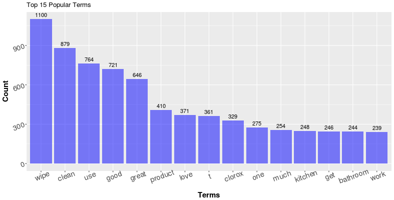
_Top mentioned terms for Clorox Wipes_

As an example, the plot above shows the top 15 most used terms (with stop-words like the, a, an, etc removed) in
 the Amazon review of my favorite product in household cleaning, the
 [Clorox disinfecting wipes](https://www.amazon.com/Clorox-Disinfecting-Wipes-Bleach-Cleaning/dp/B00IA6IBP2/ref=sr_1_2_sspa?keywords=clorox+wipes+bleach+free&qid=1554506986&s=pantry&sr=8-2-spons&psc=1).
 While word or tokens like "t" are basically impossible to interpret in the first place, it is also tricky to understand
 customer feedback from tokens like “wipe", "get" and "one." What are they talking about exactly? Sometimes we could
 improve the results by adding additional stop-words dynamically (stop words based on product names and descriptions) or by
 choosing a better tokenizing algorithm, which could prevent tokens like "t" from appearing as popular terms (The
 token "t" is very likely a part of "don't" or "doesn't". The preprocessing algorithm treated it as a separate token
 after removing punctuation). However, it is hard to find a universal solution that makes every token interpretable.

### 2. The lack of context - Tokens in isolation sometimes result in ambiguity and superficial information.

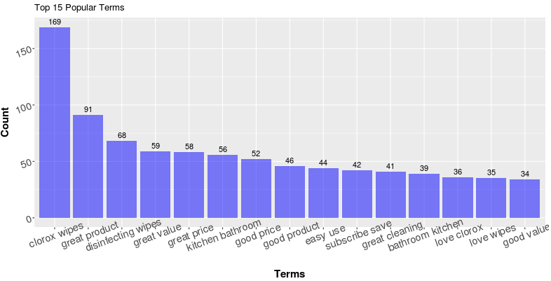
_Bi-gram_

In the same example above, terms like “good”, “love”, “bathroom” seem to be informative. It is intuitive to understand
 them as in “The product is good,” “I love it” and “they are good for cleaning bathrooms.” However, those terms are
 also possible to appear in totally opposite scenarios. The user could be saying “This product is not good,” “I love
 the XYZ wipe better than these” or “they are not suitable for bathrooms.” More importantly, assuming our intuition
 for the terms are correct (that the consumers are indeed praising our products), the information that the tokens
 itself can provide is always limited. Sure, the consumers talk about “product” 410 times, but what about the product?
 The term “work” is used 239 times, but what is working? What is not working? While the problem of ambiguity could be
 potentially resolved by switching from uni-gram to n-gram (that is, count frequencies of token combinations instead of
 single tokens), or use a [word tree](https://www.jasondavies.com/wordtree/), it seems that the problem of the lack of depth is in the nature of vanilla
 frequency based visualizations. So how can we improve the frequency based visualizations so that it can get us more
 insights?

## Utilize Part-of-Speech Tagging

To gain more insights, we first need additional information on the reviews other than the text contents themselves.
 In my experience tackling text data, I find Part-of-Speech (POS) of the reviews extremely helpful.

Part-of-speech (POS) is a category to which a word is assigned in accordance with its syntactic functions i.e. Nouns, Verbs, Adjectives, etc. When we think about the user reviews towards a certain product together with the part-of-speech components
 of text, it shouldn’t be surprising that the terms or tokens which provide the most insightful information are very likely found as Nouns or Adjectives. Nouns help explain the “What” question (what are the consumer talking about the product, the subjects. It could be packaging, delivery, smell, etc), while adjectives help with the “what about” question. (What about packaging; what about delivery; what about the smell). For tens of thousands of user reviews, we get the part-of-speech for each token in each review through a method called “Part-of-speech tagging.”

Part-of-speech tagging is a classic research topic on text analysis,and relevant techniques are rather mature today. One of the most popular approaches to performing the POS tagging would be the
 Hidden Markov Models and its variants. In summary, a Hidden Markov Model generates the part-of-speech tags by
 calculating the **Emission Probability** and the **Transition Probability** of each possible permutations of tags in the
 training data. Then it decides the “correct” set of tags based on maximum likelihood. For example, consider the
 sentence “I hate this product” and the set of part-of-speech tags [N, V, Adj, N], the Emission Probabilities are:

P(term “i” is used as a noun), P(term “hate” is used as a verb), P(term ‘this’ is used as an adjective), and P(term “product” is used as a noun).

The Transition Probability is:

P(A sentence starts with a noun) * P(A verb follows a noun) * P(An adjective follows a verb) * P(A noun follows an adjective) * P(A sentence ends with a noun).

Eventually, we multiply all the probabilities above together to get the final probability of the sentence
 “I hate this product” gets the tag [N, V, Adj, N]. If this probability is higher than all other possible
 permutations of tags, the model will then classify [N, V, Adj, N] as the correct label for this sentence.
 Although this sounds like an overwhelming amount of computation, it is actually not too bad in reality with
 the help of several algorithmic methods including Dynamic Programming (Notice that the calculation of the
 likelihoods is a chained multiplication, one zero in the chain results in a “zero” result. Dynamic programming
 takes advantage of this information). This additional layer of information provided by POS sometimes helps
 resolve the ambiguity problem conveniently. For example, in the top 15 most popular terms of Clorox Wipes above,
 the term “clean” is pretty ambiguous. We don’t know if the users are saying that the wipes make their home clean,
 or they are saying something like “I use this to clean my house” in more neutral sentiment. However, if we see the
 word “clean” in the top 15 most popular adjectives, then we know it’s the former.

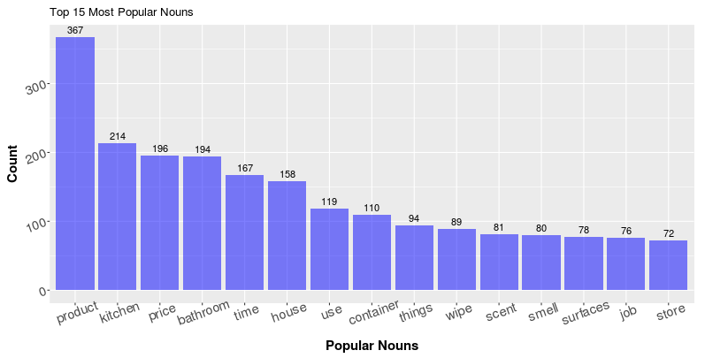
_Top Nouns_

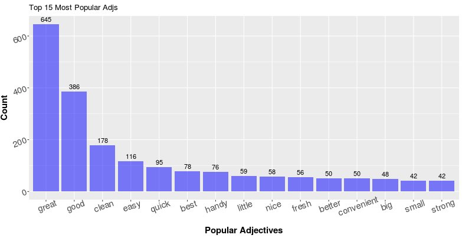
_Top Adjectives_

Below, you can find the top 15 most popular nouns and adjectives for the Clorox wipes I mentioned above. As you can see, comparing with the vanilla popular tokens, most of the terms we have in the charts below are easily interpretable.

## Related Term Search

Now that we have the frequencies of Nouns and Adjectives, the next step will be to find the relationships between them to further address the lack of context problem. Specifically, for a popular noun, how can we know the top related Adjectives? Similarly for an Adjective, how can we know the top related Nouns? Knowing the related terms can potentially help us deepen the information we get from the texts, but the task itself is not as straightforward
 as it seems to be.

Take the term “price” as an example. It is shown in the plot above as the third popular nouns, now I would like to
 know what about the price by looking at top related adjectives that our consumer use. Then we have a problem - how to
 define related? More specifically, how to construct a search algorithm that finds and displays the top related
 adjectives?

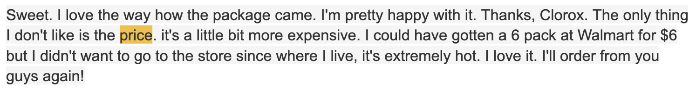

Let me use the following review as an example to help illustrate my approach:

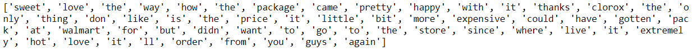

Below is the tokenized version of the reivew:

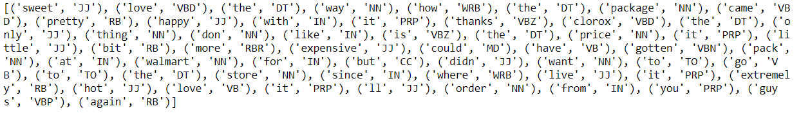

Below is the review tagged with Part-of-Speech. Here I used the pos_tag function under the nltk (3.2.4) package in Python 3.6.2:

In [this POS tagging reference](https://pythonprogramming.net/natural-language-toolkit-nltk-part-speech-tagging/), you can find what each tag represents. In this example, all you need to know is: NN, NNs stand for singular and plural nouns while JJ stands for adjectives.

In this case, let’s call the term “price” as the **target term** as we want to get information about “price.” Within a specific review, we repeat the following steps for each occurrence of the target term.

1. Identify the position of the target term (highlighted in yellow)

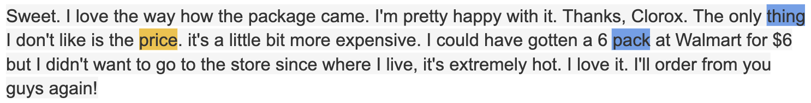

2. Find the nearest terms with the same POS tag as the target term. Call them the “boundary terms” (highlighted in blue). In this case, since “price” is a noun, the boundary terms will be the nearest nouns.

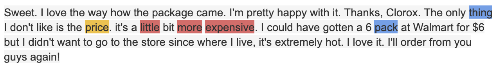

3. Find all the adjectives within the boundary terms and save them into a list

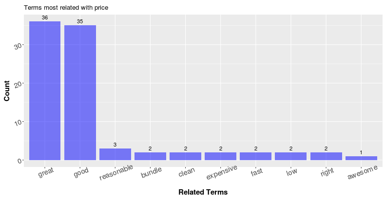

Then we repeat the same process above with “price” as the target term for all the reviews. Eventually, we will have a list of adjectives that are potentially “related” with the term **price**. In this way, I am able to get the top-15 related adjectives as below:

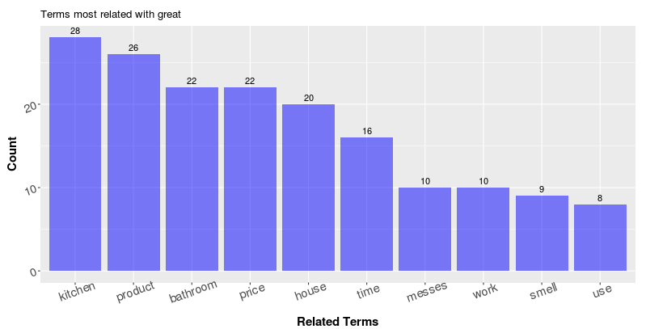

Terms like “good” and “great” are extremely popular. Which is actually true as we can find lots of reviews on Amazon that says “good price” and “great price.”
 This is not a complicated approach, but it seems to be very effective in helping us deepen the level of information we get. On the other hand, as in the plot above, reviewers use the term “great” a lot as an adjective, and I would like to know what is great about this product. I can repeat the process above with minor changes to obtain the following result:

It seems that people think the wipe is great for the kitchen, bathroom and their houses in general; The product works great and smells great. Furthermore, with the Part-of-speech information and the related term search, we can eaily generate a table like below that provides a pretty informative summary of the entire review collections

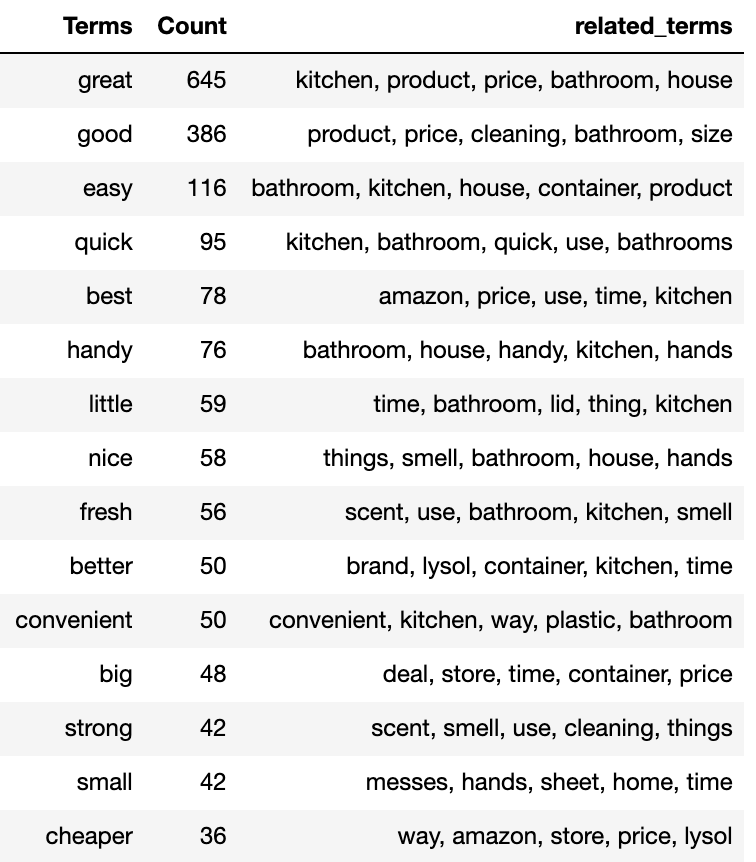

While being helpful, this approach of finding related terms with part-of-speech tagging is not perfect. It is doing a greedy search within the boundary terms based on the frequency and lots of noises will be included (for example, you will see some adjectives that are obviously not used to describe the target noun). It requires a certain amount of data so that the “real” related terms can actually “stand-out.” If our goal is really to retrieve highly in-depth and comprehensive information from a large collection of text, we may want to move away from frequency counts and adopt a neural-network-based approach. For example, we could label each review with both the questions we would like to ask and the sentence within the review that contains the answer to the question, then the network can learn to extract the related sentences with respect to each question. Of course, such techniques are beyond the scope of this blog. If you are interested, [this paper by Danqi Chen](https://stacks.stanford.edu/file/druid:gd576xb1833/thesis-augmented.pdf) from Stanford University is a great paper about neural reading comprehension.

Lastly, this method I came up with is a simple "add-on" to text data visualization with the goal of getting more interpretable information from text. I hope it helps with your data analysis projects in practice and sparkles some thoughts and ideas when you encounter text data in the future. [Here](https://github.com/ALaughingHorse/improve_text_viz/tree/master/code), you can find the all related functions I wrote for the methods described above, with which you will be able to reproduce the plots I got. Unfortunately, I cannot host the review data I scraped due to regulations, so you'll need to scrap your own data to play with. Thank you very much for reading through!
